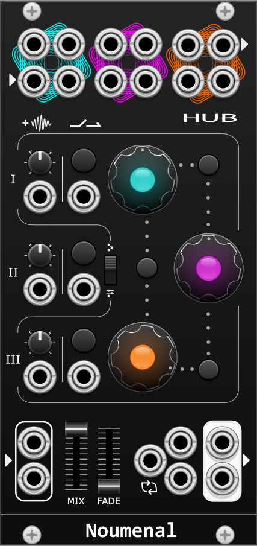

# Noumenal
Public repository for Noumenal - [VCV Rack v2](https://vcvrack.com/) modules

## Modules
### HUB
HUB is a stereo effect mixer and chain manipulator featuring parallel-sequential switching, feedback generation, and smooth bypass with fades.

#### Signal flow
There are 3 stereo send-return loops (*Paths*) marked with distinct colors.
The main input goes through a selection of these either in a specified order or in parallel, mixed together after the effects.
The signal flow is determined by the parallel-sequential switch in the middle and the three *Stage* controls.  
 
**Parallel-Sequential** switch:  
- In Parallel mode, a copy of the main input is sent to every stage and mixed together before reaching the main output.
In this mode you can use the module as a three channel stereo mixer by disregarding the main input and the send outputs, connecting only the return inputs. You can still utilize the CV modulated mix controls and parameterized fades on the bypass switches.
- In Sequential mode the main input signal goes through the stages in order [ I => II => III ], before going to the main output. Each stage crossfades between the previous one's output and the current stage's post-effect signal. In addition you can swap the Paths between two neighbouring Stages by pushing the Swap button connected to them by a dotted line.

The **Stage controls** consist of:
- a Path selector button: a large LED that changes the selected Path when pushed - the LED shows the color of the selected Path.
- a mix knob around the Path selector determining how much of the affected signal is mixed back. The Path selector LED brightness is changing according to the mix value.  
This knob does not control the signal strength sent out but the amount of the wet signal mixed back. The strength of the signal sent out is all or nothing. All if the mix knob is set to any non-zero value, and the Stage is not bypassed. Bypassing or setting the mix to zero cuts the signal sent out, in order to prevent _accidental_ feedback. 
- Each Stage has a bypass and a modulation CV input on the left.

**Bypass**:
Each Stage has a Bypass button on the left control section turning the given Stage on/off. The switch can be instantaneous or faded. The fade-in and fade-out times are both determined by the Fade slider.  
**Bypass CV**: Triggers and gates have different effects on bypass. A trigger is equivalent to a push to the bypass button, but a gate will turn the Stage ON while HIGH, and turn it OFF when goes LOW. (The gate does not flip the state of the Stage, it only follows HIGH=ON, LOW=OFF, so sending a gate to an active stage will leave it inactive when the gate goes down.)

**Swap buttons**:
There are buttons between the Stage controls that allow swapping the Paths of two neighbouring Stages.
This only affects the output in Sequential mode. There are CV inputs for each of the swap buttons receiving triggers.
When swapping two stages, a quick fade out is always applied, then the updated signal path fades back in. The fade out speed is constant, the fade back is affected by the Fade slider. [This functionality may be changed in the future as it affects higher-rate swaps negatively.]

**Fade slider**: Controls the fade times when bypass or swap is used. The fade time can be changed between none and about 5 seconds. [This may also be finetuned in the future, so I happily accept user requests!]

**Mix slider**: crossfades between the common output of the Stages and the main dry input, so you can attenuate/bring in the channels together without compromising their balance.

**Stereo**: The left channel is left/mono, so it is copied to the right when the other is not patched.

**Feedback**: Feedback can be obtained by sending two Stages to the same Path.  
For the most control, turn the second Stage's mix close to zero (non-zero mix values send the full signal out) and use the first stage as a control for feedback amount. Setting any of the involved channels to zero, or bypassing them cuts the feedback. Be careful though: the Bypass button is affected by the Fade value and the tail of the fade-out keeps the feedback path open. Every effect reacts differently to feedback, so some experimentation is needed for the best results.
